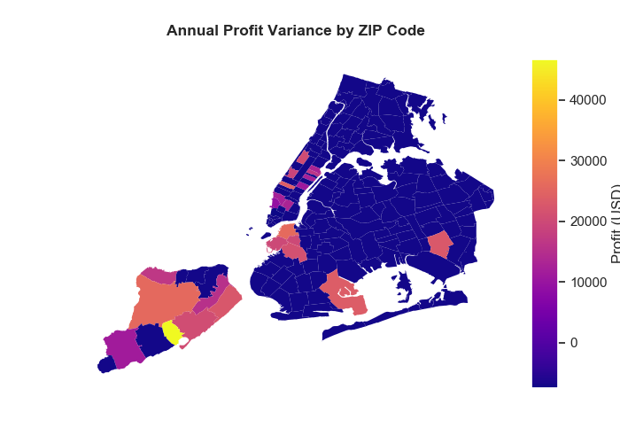

# Airbnb House Rental Recomemndation

## Introduction
This is a personal project I did to push myself to learn frequently-used Python packages: numpy, pandas, matplotlib, and seaborn.

## Background
A real estate company plans to purchase properties to rent out short-term as part of their business model specifically within New York City.   
The real estate company has already known that two-bedroom properties are the most profitable.   
However, they do not know which zip codes are the best to invest in. 

## Project Objective
1) Build out a data product to help the real estate company understand which zip codes would generate the most profit on short-term house rentals within NYC on the Airbnb platform.  
2) Wrtie well-formatted and well-commented codes.  
3) Present conclusion with visualizations.
  
## Datasets
**Cost dataset:** Zillow provides us an estimate of value for two-bedroom properties 
**Revenue dataset:** AirBnB is the medium through which the investor plans to lease out their investment property. Fortunately, we are able to see how much properties in certain neighborhoods rent out for in New York City.

## Conclusion
Zip codes in the staten island are the most ideal ones to invest in, while Manhattan's are not due to the high cost. 

## Executive Report
I wrote a thorough report to document the analysis process. Please find it in the file *Report-Airbnb rental*.  
You are also welcomed to view the slides in the file *Presentation-Airbnb rental*.

## Visualizations
Some visual examples. Find more in the *Images* folder.

